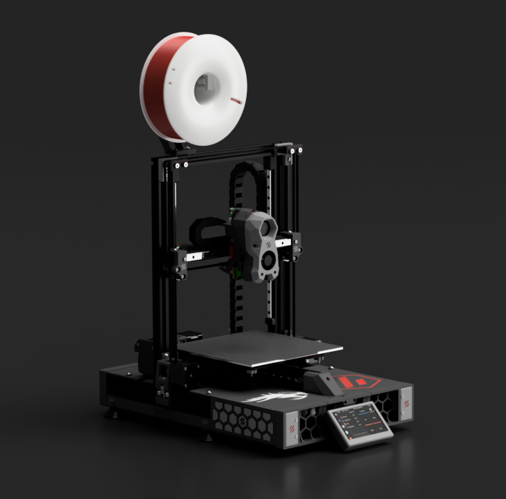

# Ender 3 Pro/V2 to Switchwire Conversion Release.2

This is a full conversion of the popular Ender 3 Pro/V2 to a Voron Switchwire. The motivation came from [Triano](https://github.com/walttriano) and [his awesome original conversion](https://github.com/walttriano/VoronUsers/tree/master/printer_mods/Triano/Ender_3Pro_Switchwire) that served as a starting point, however everything was re-designed from scratch (in order to follow the Voron guidelines and aesthetics more accurately). Another factor that led to this re-design, was the need to be able to enclose this printer in a, visually, pleasant and, structurally, functional way. The ingenious design of 5x MGN12H Linear Rails - 300mm (dual Y axis rail) from Triano was preserved and the printing volume is ~220x220x220.

# Release 2 Update Changelog:

- CAD files cleaned up.
- Small corrections to parts.
- Added printable deck files (still it's recommended to laser cut them though)
- Added different .dxfs for rear black panels (in case anyone wants to cut the panels from a material that is not same on both surfaces)
- Added the option to use the stock Ender 3 LCD screen.

# Rev.2 Update Changelog:

- Every change happened in order to improve the build process and the design overall.
- All screw sizes and types are properly documented in the CAD (soon there will be a conversion BOM also). Also no more “exotic” sizes, everything is according to what VORON is using officially.
- Current conversion’s enclosure is 100% compatible with the new update (except of the deck panels ofc).
- XZ Blocks improved fit for the X v-slots and are also modified to use 30mm BHCS (like the original SW).
- Y Axis, new front idler (in order to achieve a mounting point for the front grill), improved clearance for the rear Y motor mount. All use BHCS screws now.
- Split bed carriage with size and clearance corrections. Made uppon the design recommendation of Steve. Also Y belt clips have a bit more clearance on the upper side, in order to leave some space for spare belt 🙂
- XZ motors have thinner XZ tensioners to avoid the lower “split” (kudos to Steve for that ALSO).
- We are now using the original SW Spool Holder (for easier installation, due to clearance)
- Front Grills have now the LCD mount of the original SW. They also mount to the extended sides just by M3 screws.
- Rear Grills mount by M5x16 BHCS screws now. Also the inlet has moved to the side (in order to have a straight and easier connection with the PSU), this was also a recommendation by Steve and he was more than kind to share his original .F3D file. Both stock Ender and C14 inlets are compatible.
- Removed material from the grills, in order to save some plastic and cut down print time.
- PSU is now mounted parallel to the side extrusions and RS25 can be mounted in the front of the printer.
- Redesigned mounts for the Board and RPi (no more shelf and moooahr clearance!)

And last but not least…
-The side extensions. Front and rear side extensions are designed to extend the frame for aesthetical and a few practical reasons (clearance and NO MORE NOTCH). They are sturdy enough but keep in mind that you will not move around the printer by lifting it from there.

## Info

Various parts _can*_ be recycled from the Ender 3 Pro/V2, most important ones are:
- The frame (though a 310mm extrusion is needed for the X. You can chop the original one to length).
- The MeanWell PSU.
- The heatbed assemble.
- The original board.
- XYZ motors (as long as you can pull off the pulleys. An aftermarket 20mm motor is needed for the printhead extruder though).
- All the cables that don't go through the cable-chains (for there, silicone or PTFE cable is adviced).
- 4010 fan for the tool cooling.

*cheaping out in parts can lead into several problems, such as poor printing quality or, even worse, safety hazard. Keep that in mind and use parts from the official Switchwire BOM.

## Files

- Most of the printed part files needed for this conversion, are included in this git (you will only need to get the Stealthburner print files from the [official Switchwire git](https://github.com/VoronDesign/Voron-Stealthburner) ).
- CAD files (.f3d and .STEP) are provided, in order to help the building process, but they also serve as a BOM (in case you need to find proper screw lengths etc).
- DXF files in order to cut your enclosure panels.
- BOM (Sometime...)

## Credits

- Ofc to Triano, as his design served as base.
- To Steve (THE Steve!) for pointing out weak parts, that had to be redesigned, his tips and files and being a helpful person in general.
- To sdukan#9213 for his valuable help into troubleshooting the Ender 3 V2 differences, electronics (and in general).
- To all of this awesome community of people and especially the [ender_conversion_chat](https://discord.com/channels/460117602945990666/947303252372906014).
- To Voron design team for all the valuable resources and the solid base.

## Disclaimer

This is a very carefuly designed build.. however mistakes could have been made. By deciding to build this conversion, you are responsible for any possible damage done to the printer or even yourself.

